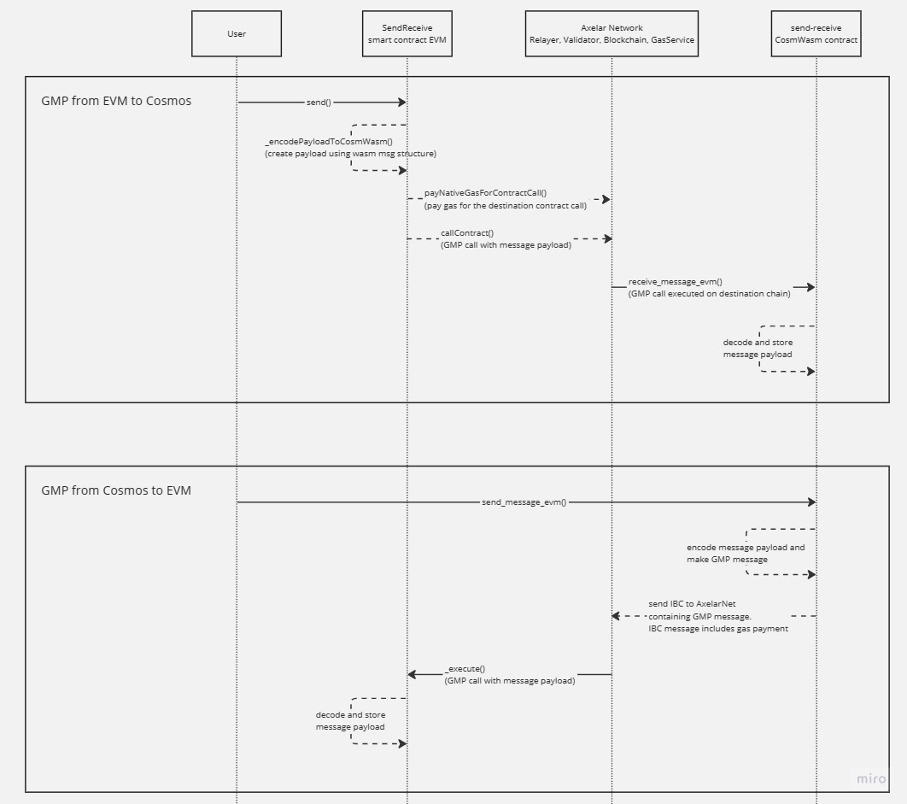

# Axelar GMP sample - passing messages between EVM <> Cosmwasm

This repo demonstrates how to pass arbitrary string messages between EVM and Cosmwasm using Axelar GMP.

## How to use
### Deployments
EVM contract deployed to: `0xcD9ce18C188B0befeE21601beE34be7Ce4cfe255`

Cosmwasm contract deployed to provenance devnet: `tp1kaulpuq2rpvz9yr3z74eyjxhu2y4yd546gvtw56urgpe8rwkxn7se9kwyk`

Substitute the osmosis and avalanche with the appropriate Cosmos and EVM chains.

### EVM
Users can call `send("osmosis-6", "osmo12uds53qp285w68vzq9wx5kjjfj0evvsy7k0e2srx9mchj29h7urq3rtuuc", "your_message_here")` to send a message to the Cosmwasm contract. Make sure to include a msg.value to pay for gas, e.g. 0.01 AVAX.

Users can query `storedMessage()` to see the most recently received message payload.

### Cosmwasm
Using osmosisd CLI: https://docs.osmosis.zone/osmosis-core/osmosisd/

Users can send a message from Cosmwasm to EVM using the following command:
```
osmosisd tx wasm execute osmo12uds53qp285w68vzq9wx5kjjfj0evvsy7k0e2srx9mchj29h7urq3rtuuc '{"send_message_evm": {"destination_chain": "Avalanche", "destination_address":"0xa88B3843E895988D423efFc4Ecc2E982f398a3Ab","message":"YOUR_MESSAGE_HERE"}}' --amount 1uosmo --from wallet --gas-prices 0.1uosmo --gas auto --gas-adjustment 1.3 -y -b block
```
> Note that `--amount 1uosmo` contains the fee paid to the Axelar Gas Service. Currently, Cosmos gas service is still under development so gas is ignored.

Users can query the stored message with the following command:
```
osmosisd query wasm contract-state smart osmo12uds53qp285w68vzq9wx5kjjfj0evvsy7k0e2srx9mchj29h7urq3rtuuc '{"get_stored_message":"{}"}'
```

## Architecture

